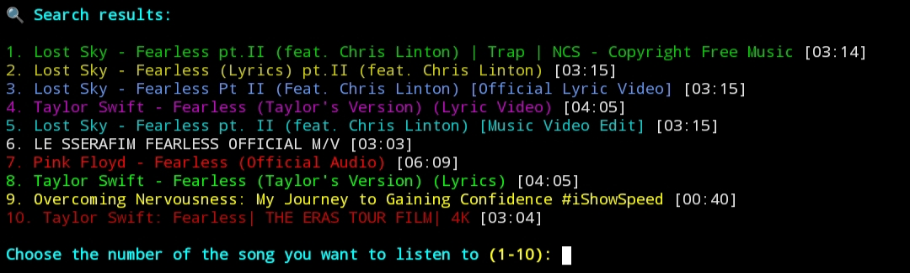

## 🌟 About
**YT-Music-Player** is a colorful terminal-based music player that streams songs directly from YouTube. Search for any song and play it instantly without downloads!

Created by [y-nabeelxd](https://github.com/y-nabeelxd)



## ✨ Features
- 🎨 **Colorful interface** with rainbow-colored search results
- 🔍 **Search YouTube** for any song
- ▶️ **Stream audio** directly (no downloads needed)
- 🚀 **Lightweight** and fast
- ⌨️ **Keyboard controls** during playback
- 📱 **Works on Termux** (Android) and other terminals

## 📦 Installation
1. **Install requirements**:
```bash
pkg install python mpv ffmpeg
pip install python-mpv yt-dlp requests colorama
```

2. **Clone the repository**:
```bash
git clone https://github.com/y-nabeelxd/YT-Music-Player.git
cd YT-Music-Player
```

3. **Run the player**:
```bash
python song.py
```

## 🎮 Usage
1. Enter a song name when prompted
2. Select from the colorful search results
3. Enjoy the music!
   - Press `q` to quit playback
   - `Space` to pause/play
   - `Left/Right` arrows to seek
   - `Up/Down` arrows for volume

## 🛠️ Requirements
- Python 3.x
- mpv media player
- ffmpeg (for audio processing)

## 📜 License
MIT License - Feel free to modify and distribute!

## 🤝 Contributing
Pull requests are welcome! For major changes, please open an issue first.

---

🎧 **Happy listening!** Let the music play! 🎶

*Created with ❤️ by y-nabeelxd*
